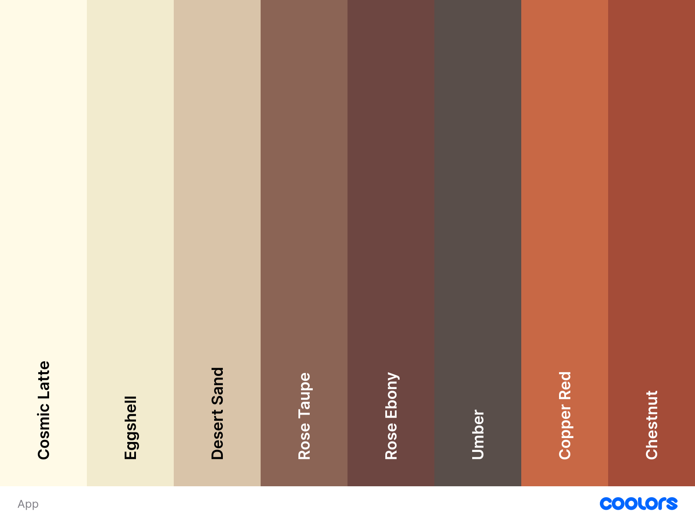

# Resume
simple lib for handling java colors in RGB color space on the  [project Sistema de Empleados](https://github.com/RitzzRiver/SistemaDeEmpleados)

the lib include this Color scheme:

# How to use
simply import the lib in library and use it in the color field as
>SetColor.COLOR;